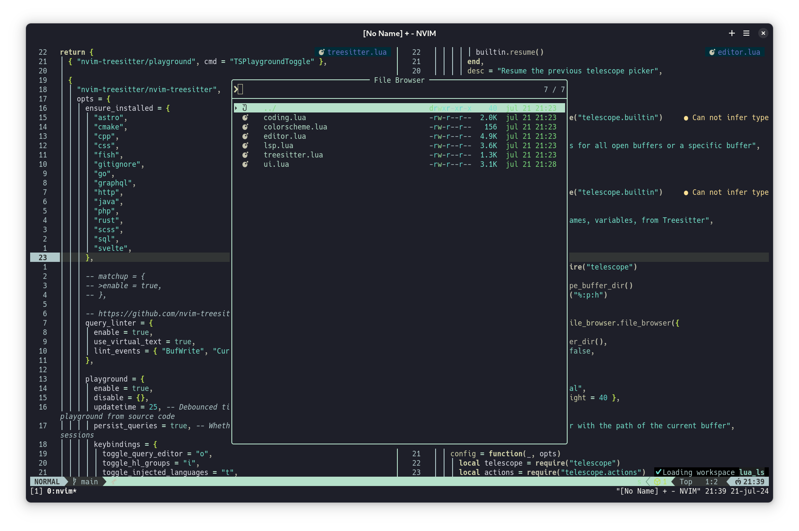

# Neovim dotfiles
---
```
This is my **neovim** working station that I'm using for software and notes.
```
---
## Dependencies
- Im using [vim-plug](https://github.com/junegunn/vim-plug) as plugin manager.
- For code completion, I'm using [coc.nvim](https://github.com/neoclide/coc.nvim)
- My Theme is nightfly [nightfly colors](https://github.com/bluz71/vim-nightfly-colors)
- Airline [airline](https://github.com/vim-airline/vim-airline)
- Neovim icons [vim devicons](https://github.com/ryanoasis/vim-devicons)
- NERDTree file manager [NERDTree](https://github.com/preservim/nerdtree)
---
## Snapshot


