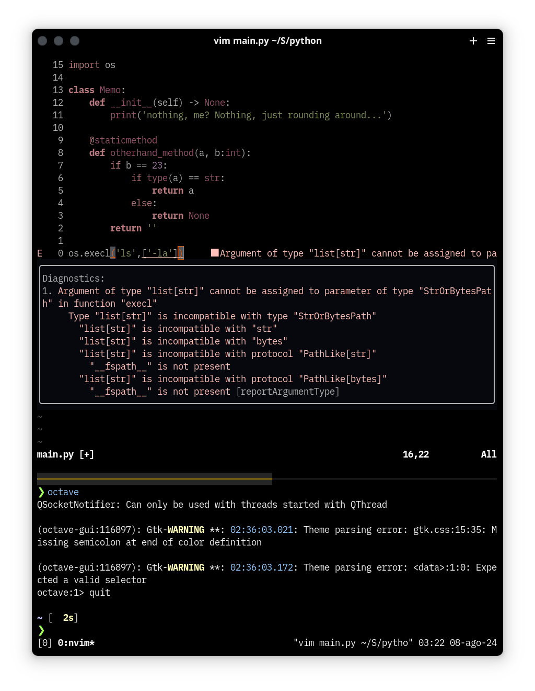

# Neovim setup
My personal neovim configuration using vimscript preferably than lua because vimscript 
has better integration with vim workflow *lua only works as an API client language*

## Dependencies
- vim Plug

